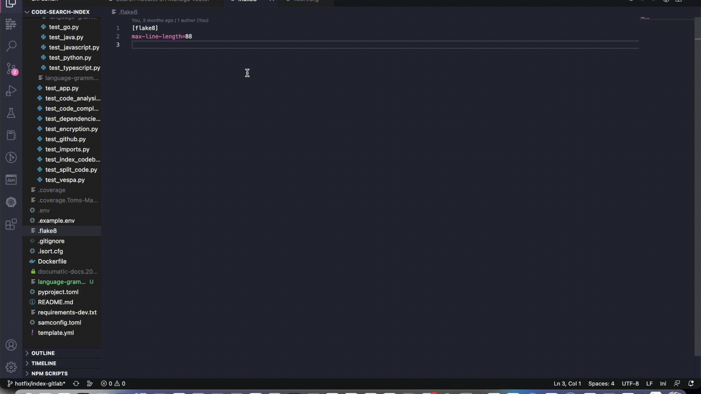

# Documatic

This extension brings [Documatic] to VSCode:
quickly search your large codebases
using simple queries -
what does it do?
what dependencies does it have?
And more.

Documatic search uses AI to link relations between
your query and snippets of code,
so you don't have to know the exact keywords
you're looking for!

<!------>

## Features

* Codesearch
  * Search your codebases using natural questions

See how to use the extension [below](#using-the-extension).

## Requirements

**IMPORTANT:** To use this extension,
you **must have an active [Documatic] account**.
Sign up for an account [here][documatic-app].
If you're on the waitlist
and would like to get your team onboarded,
please contact `shane@documatic.com`
to arrange a call.

On your Documatic account,
you must have indexed projects.
If you've very recently indexed a new codebase,
it takes a couple of minutes
for the codebase to become searchable;
if you're not getting results,
wait a few minutes.
If this persists,
please contact `shane@documatic.com`
for help.
**N.b.** You currently cannot create
Documatic projects via the VSCode extension.

## Using the extension

### Connecting your account

On the Documatic tab in VSCode, click "sign in".
This will take you to the Documatic web platform,
where you can sign in.
Once you've signed in,
you will see your Documatic organisations
and projects.

**N.b.** You currently cannot manage organisations
and projects from the extension.
Please log in to the [Documatic][documatic-app]
web application to make changes.

### Codesearch

To run a search:

* Run the command "Documatic Search" or use the shortcut `cmd + K`.
* Type in your search in query into the text field and press enter
* Select which project to run your search over (defaults to all projects)
  * The extension shows which projects, if any, are in your active VSCode workspace
* The extension will display the top code snippets in a list
* Click on "view" to be navigated to a code snippet
  * If the project is in your active VSCode workspace, your will be navigated to the code file
  * If the project is not in your workspace, a copy of the code file will be created and opened

**N.b.** The version of the codebase indexed for search
is the main/master branch at time of indexing.
**Documatic does not index a live version of your codebase**.
The extension still works on other branches,
however changing branches or making updates to the code
may result in discrepencies between line numbers
when navigating to the code.
Documatic reindexes your codebases regularly.
If you would like non-main branches to be indexed
for your team,
please contact `shane@documatic.com`.

## Known Issues

* If you close the search results page, it will not appear when making a new search
  * While we fix this, keep the search results page open between searches
* Your signed in session can time out on the extension without the UI updating
  * As a temporary work around, clearing your VSCode session can reset this

## Changelog

For full release notes,
please see the complete changelog
in the repository.

### 0.2.1

Fixed a sign-in issue.

### 0.2.0

Initial release of Documatic's VSCode extension.
Comes with codesearch and code snippet analysis.

## About Documatic

Documatic is a startup
building tools to help you better understand your code.\
Don't ask your boss,
ask [Documatic].

[documatic]: https://www.documatic.com
[documatic-app]: https://app.documatic.com
